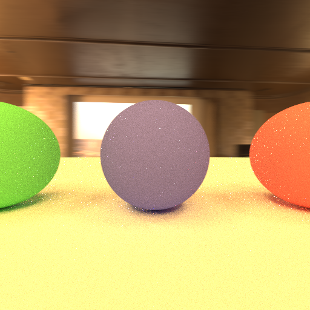

# raytracing

Raytracer implemented with C++. This is based on this book.
https://booth.pm/en/items/1159865

# how to run

Download `stb_image.h`.

Download hdr file (currently using https://polyhaven.com/a/pretville_cinema).

Make project.

Run `path_tracing` or `thinlens`.

**I'm not an author of this book.**
